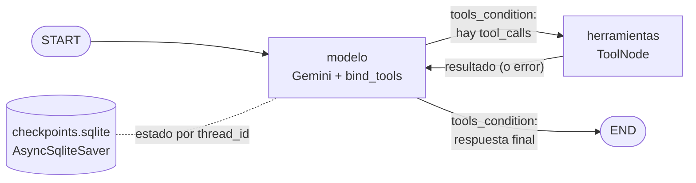

# Agente ReAct cíclico con memoria persistente

Pre-entrega 5 de **AI Engineering (Coderhouse)**. Es un agente construido con **LangGraph** que decide por sí mismo cuándo
consultar una base de datos de pedidos simulada. Encadena varias herramientas para responder una pregunta,
se recupera de los errores y recuerda la conversación entre ejecuciones gracias a un checkpointer **SQLite**.

- **LLM:** Gemini (`langchain-google-genai`), vinculado a las herramientas con `llm.bind_tools()`.
- **Grafo:** `StateGraph` con un estado que hereda de `MessagesState`, un nodo de modelo, un nodo de herramientas y una arista condicional `tools_condition`.
- **Persistencia:** `AsyncSqliteSaver` (la variante async de `SqliteSaver`) + `thread_id`.
- **Código:** Python ≥ 3.12, type hints verificados con `mypy --strict`, todo asíncrono con `asyncio`.

---

## Cómo levantar el entorno

Requisitos: Python 3.12 o superior y una API key de Gemini (gratis en <https://aistudio.google.com/apikey>).

```bash
git clone <git remote add origin https://github.com/luciaariasdanna/PreEntrega5-ReAct-memoria.git>
cd <PreEntrega5-ReAct-memoria>
python -m venv .venv
```

Activá el entorno virtual:

```bash
# Windows (PowerShell)
.venv\Scripts\Activate.ps1
# Linux / macOS
source .venv/bin/activate
```

Instalá las dependencias y configurá la key:

```bash
pip install -r requirements.txt
cp .env.example .env        # en Windows: copy .env.example .env
```

Editá `.env` y pegá tu `GOOGLE_API_KEY`. El archivo `.env` está en `.gitignore`, así que la key nunca se sube al repo.

El modelo por defecto es `gemini-flash-lite-latest`. Si Gemini responde `503 UNAVAILABLE` ("high demand"), la
saturación es del lado de Google: esperá un rato o probá otro modelo cambiando `GEMINI_MODEL` en `.env`.

### Ejecutar

```bash
# 1) Prueba de ejecución completa: corre los escenarios y regenera la traza en trazas/
python demo.py

# 2) Chat interactivo con memoria (mostrando el ciclo ReAct de cada respuesta)
python chat.py --thread-id mi-sesion
```

Para comprobar la persistencia, escribí `salir` y volvé a ejecutar `python chat.py --thread-id mi-sesion`: el agente
recuerda la conversación. Si lo ejecutás con otro `--thread-id`, arranca de cero.

### Verificar tipos (opcional)

```bash
pip install -r requirements-dev.txt
mypy agente demo.py chat.py
```

---

## Estructura

```
.
├── agente/
│   ├── datos.py         # "Base de datos" simulada: tablas clientes y pedidos
│   ├── herramientas.py  # Fase 1: herramientas @tool (async) con docstrings descriptivos
│   ├── grafo.py         # Fase 2: EstadoAgente(MessagesState) + StateGraph + tools_condition
│   ├── runtime.py       # Fase 3: compilación con AsyncSqliteSaver, thread_id, recursion_limit
│   ├── traza.py         # Serialización de la traza ReAct a JSON / log
│   └── config.py        # Lectura de variables de entorno (.env)
├── demo.py              # Prueba de ejecución que genera la traza
├── chat.py              # Chat interactivo por consola
├── trazas/
│   ├── traza_ejecucion.json   # Traza ReAct completa (entregable)
│   └── traza_ejecucion.log    # La misma traza en formato legible
├── .env.example         # Plantilla de variables de entorno (sin secretos)
├── requirements.txt
└── pyproject.toml       # requires-python >= 3.12 + configuración de mypy strict
```

## Arquitectura



**Todo camino empieza en START y termina en END.** El único nodo con salida hacia END es `modelo`, y llega ahí
cada vez que responde sin `tool_calls`:

| Camino | Cómo termina |
|---|---|
| Pregunta que no necesita datos | `START → modelo → END` |
| Pregunta multi-paso | `START → modelo → herramientas → modelo → herramientas → modelo → END` |
| Herramienta devuelve error | El error vuelve al `modelo`, que reintenta o pide aclaración (respuesta sin `tool_calls`) `→ END` |
| El agente entra en bucle | Antes de llegar a `recursion_limit`, el `modelo` ve que `remaining_steps` no alcanza para otra vuelta y responde sin `tool_calls` `→ END` |

El último caso importa: si se deja que LangGraph choque contra `recursion_limit`, lanza `GraphRecursionError` y
corta el grafo a la mitad, **sin pasar por END**. Para evitarlo, `EstadoAgente` declara
`remaining_steps: RemainingSteps`, un valor que LangGraph calcula en cada paso. El nodo modelo lo consulta y, si no
quedan al menos 2 pasos (herramienta + modelo), cierra él mismo la conversación.

### Relación con un flujo "clasificar → acción → ¿éxito? → reintentar → final"
En un grafo ReAct, esos pasos no son nodos separados con `if/else`: los hace el LLM dentro del ciclo.

- **Clasificar la intención** y **generar la respuesta** ocurren en el nodo `modelo`: el LLM decide si llama a una herramienta (y a cuál) o si responde.
- **Ejecutar la acción** es el nodo `herramientas` (`ToolNode`).
- **¿Éxito? / manejar el error y reintentar** es la arista `herramientas → modelo`: el resultado, aunque sea un error, vuelve al LLM, que decide si reintenta, pide aclaración o termina.

Un nodo clasificador con rutas fijas iría contra el criterio de **autonomía** de la consigna.

### Herramientas

| Herramienta | Entrada | Devuelve |
|---|---|---|
| `buscar_cliente_por_nombre` | `nombre: str` | `cliente_id`, o `error` + `sugerencias` de nombres parecidos |
| `buscar_pedidos` | `cliente_id: int` | cantidad de pedidos y total gastado |
| `obtener_ultimo_pedido` | `cliente_id: int` | número, fecha, monto y estado del pedido más reciente |

Los pedidos se indexan por `cliente_id`, pero el usuario pregunta por **nombre**. Por eso el agente tiene que
encadenar al menos dos herramientas (nombre → id → pedidos), y nadie le indica ese orden: lo deduce de los docstrings.

---

## Cómo se cumple cada criterio (y por qué)

### 1. Autonomía: sin rutas `if/else`
El código nunca decide qué herramienta usar. `llm.bind_tools(HERRAMIENTAS)` le envía al modelo el *schema* de cada
herramienta: nombre, parámetros tipados y docstring. Con esa información, el modelo responde con texto o con `tool_calls`.
`tools_condition` solo mira si el último mensaje trae `tool_calls`. Si los trae, va al nodo de herramientas; si no, termina.

**Por qué los docstrings son tan largos:** son lo único que el LLM lee para elegir. Cada uno dice *cuándo* usar la
herramienta, *qué* requiere (por ejemplo, "requiere el cliente_id numérico, NO el nombre") y *qué hacer* si falla.
Cuando un agente no usa la herramienta que esperás, casi siempre hay que corregir el docstring, no el grafo.

### 2. Ciclo de retorno: reintento o aclaración
- La arista `herramientas → modelo` es el **ciclo**: el modelo siempre ve el resultado de la herramienta y decide de nuevo.
- Las herramientas devuelven errores como datos (`{"error": ..., "sugerencias": [...]}`) en vez de lanzar excepciones.
  Así el modelo puede razonar sobre ellos:
  - **Reintento:** si preguntás por "Ana Garcia" (sin tilde), la herramienta sugiere "Ana García" y el agente vuelve a llamarla con el nombre corregido.
  - **Aclaración:** si preguntás por "Roberto Sánchez", no hay sugerencias, así que el agente le pide al usuario que confirme el nombre en lugar de inventar.
- `ToolNode(..., handle_tool_errors=True)` cubre los errores inesperados. Si el modelo manda, por ejemplo, un
  `cliente_id` que no es un número, la excepción vuelve como `ToolMessage` de error y el modelo puede corregirse, en lugar de que se rompa el programa.

### 3. Resiliencia de estado: `thread_id` + SQLite
El grafo se compila con `checkpointer=AsyncSqliteSaver(...)`. Después de **cada paso** del grafo, LangGraph guarda
el estado en `checkpoints.sqlite`, indexado por `thread_id`. Al invocar de nuevo con el mismo `thread_id`, carga ese
estado y le agrega el mensaje nuevo, de modo que el LLM recibe el historial completo. Por eso "¿Y el último?" funciona:
el modelo ve en el historial que se hablaba de Ana García (`cliente_id=102`) y llama directamente a `obtener_ultimo_pedido(102)`.

**Por qué `AsyncSqliteSaver` y no `SqliteSaver`:** son la misma persistencia del mismo paquete
(`langgraph-checkpoint-sqlite`). `SqliteSaver` es síncrono y no admite `ainvoke`; como la consigna pide `asyncio`,
usamos su variante async.

En `demo.py`, la conexión a SQLite se cierra y se vuelve a abrir entre sesiones. Eso demuestra que la memoria sale del
archivo en disco y no de una variable en RAM. `chat.py` lo prueba entre procesos distintos.

### 4. Código limpio
- **Python ≥ 3.12:** se usan `type Alias = ...` (PEP 695) y `match/case`; `requires-python = ">=3.12"` en `pyproject.toml`.
- **Type hints** en todo el código, verificados con `mypy --strict` sin errores.
- **Asíncrono de punta a punta:** las herramientas son `async def` (con `asyncio.sleep` para simular latencia de base de datos), el nodo del modelo usa `ainvoke` y el checkpointer es async.

### Errores comunes que evitamos
- **Descripciones vagas:** docstrings con cuándo usar la herramienta, requisitos y comportamiento ante error.
- **Bucles infinitos:** `recursion_limit=10` en cada invocación. Una vuelta modelo → herramienta consume 2 pasos,
  así que el agente puede hacer unas 4 llamadas a herramientas por pregunta. Antes de llegar al techo, el nodo
  modelo usa `remaining_steps` para cerrar con una respuesta y llegar a END. Además, el LLM está configurado
  con `max_retries=3` y `timeout=60`: si la API está saturada, el programa falla con un error claro en lugar de quedarse colgado.
- **Estado sucio:** el estado se acumula con cada turno. `recortar_historial()` usa `trim_messages` para mandarle al
  LLM solo los últimos `MAX_MENSAJES_CONTEXTO` mensajes (20 por defecto); el historial completo sigue guardado en SQLite.
  `start_on="human"` evita que el recorte deje un resultado de herramienta sin la llamada que lo originó.

### Sobre los reducers
LangGraph no modifica el estado: cada nodo devuelve un *update* y un **reducer** lo combina con el estado anterior.
`MessagesState` define `messages` con el reducer `add_messages`, que funciona como `operator.add` (agrega a la lista)
pero además deduplica por id de mensaje. `EstadoAgente` hereda de `MessagesState` y suma un campo
`llamadas_a_herramientas: Annotated[int, operator.add]`: cada vez que el modelo pide herramientas, el contador se
suma al acumulado del thread.

---

## Traza de ejecución

La traza completa de `python demo.py` está en [`trazas/traza_ejecucion.json`](trazas/traza_ejecucion.json)
(y en formato legible en [`trazas/traza_ejecucion.log`](trazas/traza_ejecucion.log)). Incluye tres escenarios:

1. **Multi-paso + memoria:** "¿Cuántos pedidos tuvo Ana García y cuál fue el total?" usa 2 herramientas. Después, con el mismo `thread_id`, "¿Y el último?" y "¿Y Juan Pérez?".
2. **Reintento:** "Ana Garcia" sin tilde → error con sugerencia → segundo intento.
3. **Aclaración:** cliente inexistente → el agente pide aclaración → el usuario corrige → el agente responde.

### Extracto (salida real con `gemini-flash-lite-latest`)

**Multi-paso + memoria** (la herramienta se invoca 2 veces; después el agente recuerda que hablábamos del cliente 102):

```text
[thread_id=demo-multi-paso]
Usuario: "¿Cuántos pedidos tuvo Ana García y cuál fue el total?"
  -> El agente decide usar la herramienta: buscar_cliente_por_nombre(nombre='Ana García')
  -> La herramienta devuelve: {"nombre": "Ana García", "cliente_id": 102}
  -> El agente decide usar la herramienta: buscar_pedidos(cliente_id=102)
  -> La herramienta devuelve: {"cliente_id": 102, "pedidos": 3, "total": 14500}
  -> El agente razona: no necesita más herramientas -> responde.
Respuesta: "Ana García tuvo 3 pedidos y el total gastado es de $14.500."
(herramientas invocadas en este turno: 2)

[thread_id=demo-multi-paso]
Usuario: "¿Y el último?"
  -> El agente decide usar la herramienta: obtener_ultimo_pedido(cliente_id=102)
  -> La herramienta devuelve: {"cliente_id": 102, "pedido_id": 9045, "fecha": "2026-09-21", "monto": 4200, "estado": "en camino"}
  -> El agente razona: no necesita más herramientas -> responde.
Respuesta: "Su último pedido fue el número 9045, realizado el 21/09/2026 por un monto de $4.200. Actualmente se encuentra **en camino**."
(herramientas invocadas en este turno: 1)

[thread_id=demo-multi-paso]
Usuario: "¿Y Juan Pérez?"
  -> El agente decide usar la herramienta: buscar_cliente_por_nombre(nombre='Juan Pérez')
  -> La herramienta devuelve: {"nombre": "Juan Pérez", "cliente_id": 205}
  -> El agente decide usar la herramienta: buscar_pedidos(cliente_id=205)
  -> La herramienta devuelve: {"cliente_id": 205, "pedidos": 1, "total": 3200}
  -> El agente razona: no necesita más herramientas -> responde.
Respuesta: "Juan Pérez tuvo 1 pedido y el total gastado es de $3.200."
(herramientas invocadas en este turno: 2)
```

**Ciclo de retorno — reintento** (error con sugerencia → segundo intento):

```text
[thread_id=demo-reintento]
Usuario: "¿Cuánto gastó en total Ana Garcia?"
  -> El agente decide usar la herramienta: buscar_cliente_por_nombre(nombre='Ana Garcia')
  -> La herramienta devuelve: {"error": "No existe ningún cliente registrado con el nombre 'Ana Garcia'.", "sugerencias": ["Ana García"]}
  -> El agente decide usar la herramienta: buscar_cliente_por_nombre(nombre='Ana García')
  -> La herramienta devuelve: {"nombre": "Ana García", "cliente_id": 102}
  -> El agente decide usar la herramienta: buscar_pedidos(cliente_id=102)
  -> La herramienta devuelve: {"cliente_id": 102, "pedidos": 3, "total": 14500}
  -> El agente razona: no necesita más herramientas -> responde.
Respuesta: "Ana García gastó un total de $14.500 en sus 3 pedidos."
(herramientas invocadas en este turno: 3)
```
